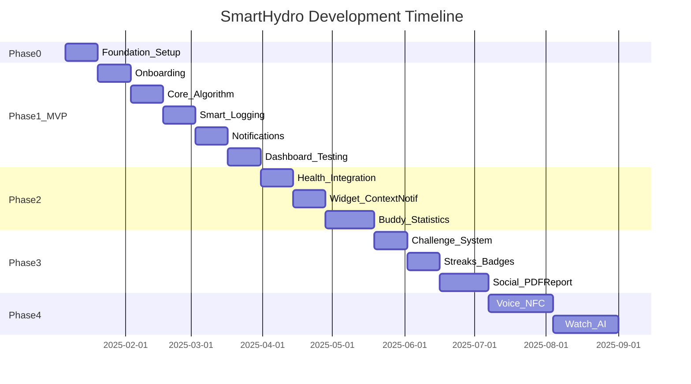

# SmartHydro Implementation Plan

## Overview

---

## Phase 0: Foundation and Setup (2 weeks)

### 0.1 Project Infrastructure

| Task | Description | Est. |

|------|-------------|------|

| [ ] 0.1.1 | Create GitHub repository with branch protection (main, develop, feature/*) | 1h |

| [ ] 0.1.2 | Setup Flutter project with folder structure per [TECH_STACK.md](docs/TECH_STACK.md) Section 8.1 | 2h |

| [ ] 0.1.3 | Setup Next.js project with App Router structure per [TECH_STACK.md](docs/TECH_STACK.md) Section 8.2 | 2h |

| [ ] 0.1.4 | Configure `pubspec.yaml` with all MVP dependencies | 1h |

| [ ] 0.1.5 | Configure `package.json` with all web dependencies | 1h |

| [ ] 0.1.6 | Setup `.env` files for dev/staging/prod environments | 1h |

### 0.2 Backend Setup (Supabase)

| Task | Description | Est. |

|------|-------------|------|

| [ ] 0.2.1 | Create Supabase project | 30m |

| [ ] 0.2.2 | Run database migrations - Core tables (users, water_logs, daily_goals) | 2h |

| [ ] 0.2.3 | Run database migrations - Gamification tables (streaks, challenges, buddy_status) | 1h |

| [ ] 0.2.4 | Run database migrations - Content tables (science_articles, notification_templates) | 1h |

| [ ] 0.2.5 | Setup RLS policies per [supabase-backend RULE.md](.cursor/rules/supabase-backend/RULE.md) | 2h |

| [ ] 0.2.6 | Create storage buckets (avatars, article-thumbnails, buddy-assets) | 30m |

| [ ] 0.2.7 | Setup Supabase Auth with Google and Apple providers | 1h |

### 0.3 DevOps and CI/CD

| Task | Description | Est. |

|------|-------------|------|

| [ ] 0.3.1 | Setup GitHub Actions for Flutter (lint, test, build) | 2h |

| [ ] 0.3.2 | Setup GitHub Actions for Next.js (lint, build, deploy to Vercel) | 1h |

| [ ] 0.3.3 | Configure Firebase project (Analytics, Crashlytics) | 1h |

| [ ] 0.3.4 | Setup Firebase App Distribution for beta testing | 1h |

| [ ] 0.3.5 | Configure Vercel project for web deployment | 30m |

### 0.4 Design Assets Preparation

| Task | Description | Est. |

|------|-------------|------|

| [ ] 0.4.1 | Create Figma project with design system per [VISUAL_DESIGN.md](docs/VISUAL_DESIGN.md) | 4h |

| [ ] 0.4.2 | Design Puru mascot states (6 states) - can use AI tools | 4h |

| [ ] 0.4.3 | Export app icons (iOS, Android all sizes) | 1h |

| [ ] 0.4.4 | Create splash screen assets | 1h |

| [ ] 0.4.5 | Prepare Lottie animations list (water fill, confetti, Puru states) | 2h |---

## Phase 1: MVP (10 weeks)

### Week 1-2: Onboarding and Profile

#### 1.1 Flutter Theme Setup

| Task | Description | Est. |

|------|-------------|------|

| [ ] 1.1.1 | Implement `ThemeData` with SmartHydro colors per [ui-visual-design RULE.md](.cursor/rules/ui-visual-design/RULE.md) | 2h |

| [ ] 1.1.2 | Setup Nunito and Inter fonts | 1h |

| [ ] 1.1.3 | Create reusable gradient decoration utilities | 1h |

| [ ] 1.1.4 | Implement glassmorphism widgets | 2h |

| [ ] 1.1.5 | Setup easy_localization with VI/EN | 2h |

#### 1.2 Authentication

| Task | Description | Est. |

|------|-------------|------|

| [ ] 1.2.1 | Create `auth` feature folder structure (data/domain/presentation) | 1h |

| [ ] 1.2.2 | Implement Supabase auth repository | 3h |

| [ ] 1.2.3 | Create auth providers (Riverpod) | 2h |

| [ ] 1.2.4 | Build Login screen with Google/Apple buttons | 3h |

| [ ] 1.2.5 | Implement auth state listener and routing | 2h |

| [ ] 1.2.6 | Write unit tests for auth repository | 2h |

#### 1.3 Onboarding Flow

| Task | Description | Est. |

|------|-------------|------|

| [ ] 1.3.1 | Design onboarding screens in Figma (5 screens) | 3h |

| [ ] 1.3.2 | Create `OnboardingScreen` with PageView | 2h |

| [ ] 1.3.3 | Build gender selection screen | 2h |

| [ ] 1.3.4 | Build birth year picker screen | 2h |

| [ ] 1.3.5 | Build weight input screen with slider (Puru size feedback) | 3h |

| [ ] 1.3.6 | Build wake/sleep time pickers | 2h |

| [ ] 1.3.7 | Build pregnancy/breastfeeding options (conditional) | 1h |

| [ ] 1.3.8 | Implement user profile save to Supabase and Isar | 3h |

| [ ] 1.3.9 | Show calculated base goal with animation | 2h |

| [ ] 1.3.10 | Write widget tests for onboarding flow | 3h |

### Week 3-4: Core Algorithm (Hydration Engine)

#### 1.4 Base Calculation Engine

| Task | Description | Est. |

|------|-------------|------|

| [ ] 1.4.1 | Create `hydration` feature folder structure | 1h |

| [ ] 1.4.2 | Implement `HydrationCalculator` class with base formula | 2h |

| [ ] 1.4.3 | Implement age-based multiplier logic (40/35/30 ml per kg) | 1h |

| [ ] 1.4.4 | Implement biology adjustments (pregnancy +300ml, breastfeeding +500ml) | 1h |

| [ ] 1.4.5 | Write comprehensive unit tests for calculator (15+ test cases) | 4h |

#### 1.5 Weather Integration

| Task | Description | Est. |

|------|-------------|------|

| [ ] 1.5.1 | Setup OpenWeatherMap API client | 2h |

| [ ] 1.5.2 | Implement location permission request flow | 2h |

| [ ] 1.5.3 | Create weather repository with caching (3-hour cache) | 3h |

| [ ] 1.5.4 | Implement weather adjustment logic (temp >30C: +10%, >35C: +15%, humidity <40%: +5%) | 2h |

| [ ] 1.5.5 | Handle permission denied fallback (manual weather input) | 2h |

| [ ] 1.5.6 | Write unit tests for weather adjustments | 2h |

#### 1.6 Daily Goal Management

| Task | Description | Est. |

|------|-------------|------|

| [ ] 1.6.1 | Create `DailyGoal` entity and Isar schema | 2h |

| [ ] 1.6.2 | Implement `DailyGoalRepository` (create, read, update) | 3h |

| [ ] 1.6.3 | Create daily goal provider with auto-calculation | 2h |

| [ ] 1.6.4 | Implement midnight reset logic with workmanager | 3h |

| [ ] 1.6.5 | Sync daily goals with Supabase | 2h |

| [ ] 1.6.6 | Write integration tests for goal management | 3h |

### Week 5-6: Smart Logging with BHI

#### 1.7 BHI System

| Task | Description | Est. |

|------|-------------|------|

| [ ] 1.7.1 | Create `BeverageType` enum with BHI values | 1h |

| [ ] 1.7.2 | Create `WaterLog` entity with Isar schema | 2h |

| [ ] 1.7.3 | Implement `WaterLogRepository` | 3h |

| [ ] 1.7.4 | Create hydration calculation method (volume * BHI factor) | 1h |

| [ ] 1.7.5 | Write unit tests for BHI calculations | 2h |

#### 1.8 Logging UI

| Task | Description | Est. |

|------|-------------|------|

| [ ] 1.8.1 | Design logging overlay in Figma | 2h |

| [ ] 1.8.2 | Build `LoggingBottomSheet` with glassmorphism | 3h |

| [ ] 1.8.3 | Create beverage type grid with icons and BHI display | 3h |

| [ ] 1.8.4 | Build volume slider with haptic feedback | 2h |

| [ ] 1.8.5 | Implement quick-add presets (150ml, 250ml, 500ml) | 1h |

| [ ] 1.8.6 | Add water splash animation on confirm | 2h |

| [ ] 1.8.7 | Show BHI tip message for low-hydration drinks | 1h |

| [ ] 1.8.8 | Implement undo functionality (5 second window) | 2h |

| [ ] 1.8.9 | Write widget tests for logging UI | 3h |

#### 1.9 Offline-First Sync

| Task | Description | Est. |

|------|-------------|------|

| [ ] 1.9.1 | Create `SyncQueue` model and Isar schema | 2h |

| [ ] 1.9.2 | Implement sync queue manager | 3h |

| [ ] 1.9.3 | Setup connectivity listener | 1h |

| [ ] 1.9.4 | Implement background sync with workmanager | 3h |

| [ ] 1.9.5 | Handle conflict resolution (last-write-wins) | 2h |

| [ ] 1.9.6 | Write integration tests for offline sync | 3h |

### Week 7-8: Smart Notifications

#### 1.10 Notification System

| Task | Description | Est. |

|------|-------------|------|

| [ ] 1.10.1 | Create `notifications` feature folder structure | 1h |

| [ ] 1.10.2 | Setup flutter_local_notifications with channels | 2h |

| [ ] 1.10.3 | Implement notification permission request | 1h |

| [ ] 1.10.4 | Create `NotificationScheduler` class | 3h |

| [ ] 1.10.5 | Implement hourly goal distribution logic | 2h |

| [ ] 1.10.6 | Implement Silent Period logic (90 min after log) | 2h |

| [ ] 1.10.7 | Implement sleep hours exclusion | 1h |

| [ ] 1.10.8 | Write unit tests for scheduler logic | 3h |

#### 1.11 Notification Templates

| Task | Description | Est. |

|------|-------------|------|

| [ ] 1.11.1 | Create notification_templates seed data (20+ templates) | 2h |

| [ ] 1.11.2 | Implement template fetcher with randomization | 2h |

| [ ] 1.11.3 | Implement placeholder replacement ({name}, {remaining_ml}) | 2h |

| [ ] 1.11.4 | Handle notification tap routing | 2h |

### Week 9-10: Dashboard and Testing

#### 1.12 Home Dashboard

| Task | Description | Est. |

|------|-------------|------|

| [ ] 1.12.1 | Design dashboard screen in Figma | 4h |

| [ ] 1.12.2 | Build dashboard layout with time-based background gradient | 3h |

| [ ] 1.12.3 | Create animated progress ring with water fill effect | 6h |

| [ ] 1.12.4 | Display current/goal values with animation | 2h |

| [ ] 1.12.5 | Add weather indicator with adjustment display | 2h |

| [ ] 1.12.6 | Create FAB with pulse animation | 2h |

| [ ] 1.12.7 | Add Puru mascot placeholder (basic states) | 3h |

| [ ] 1.12.8 | Implement "Fact of the day" card | 2h |

#### 1.13 Basic History and Stats

| Task | Description | Est. |

|------|-------------|------|

| [ ] 1.13.1 | Build today's log list view | 2h |

| [ ] 1.13.2 | Create simple weekly bar chart | 3h |

| [ ] 1.13.3 | Show week's completion summary | 2h |

#### 1.14 Science Hub (Basic)

| Task | Description | Est. |

|------|-------------|------|

| [ ] 1.14.1 | Create science_hub feature folder | 1h |

| [ ] 1.14.2 | Build article list screen (card layout) | 3h |

| [ ] 1.14.3 | Build article detail screen | 3h |

| [ ] 1.14.4 | Implement article caching | 2h |

| [ ] 1.14.5 | Seed database with 5-10 articles | 3h |

#### 1.15 Web Admin (Basic)

| Task | Description | Est. |

|------|-------------|------|

| [ ] 1.15.1 | Setup Next.js with Tailwind and Shadcn/UI | 2h |

| [ ] 1.15.2 | Implement Supabase auth for admin | 2h |

| [ ] 1.15.3 | Build admin layout with sidebar | 3h |

| [ ] 1.15.4 | Create article list page with data table | 3h |

| [ ] 1.15.5 | Create article editor with Tiptap | 4h |

| [ ] 1.15.6 | Implement image upload to Supabase Storage | 2h |

| [ ] 1.15.7 | Build notification template manager | 3h |

#### 1.16 MVP Testing and Polish

| Task | Description | Est. |

|------|-------------|------|

| [ ] 1.16.1 | Run full integration test suite | 4h |

| [ ] 1.16.2 | Performance profiling (cold start < 2s) | 4h |

| [ ] 1.16.3 | Fix critical bugs | 8h |

| [ ] 1.16.4 | UI polish and animation tuning | 4h |

| [ ] 1.16.5 | Setup TestFlight and internal testing | 2h |

| [ ] 1.16.6 | Write basic user documentation | 3h |---

## Phase 2: Enhanced Experience (7 weeks)

### Week 11-12: Health Integration

#### 2.1 Apple Health / Google Fit

| Task | Description | Est. |

|------|-------------|------|

| [ ] 2.1.1 | Setup health package with required permissions | 2h |

| [ ] 2.1.2 | Implement workout data fetcher | 3h |

| [ ] 2.1.3 | Create activity adjustment calculator (+250/350/500ml) | 2h |

| [ ] 2.1.4 | Implement sedentary time tracker | 3h |

| [ ] 2.1.5 | Handle permission denied gracefully | 2h |

| [ ] 2.1.6 | Write unit tests for activity adjustments | 2h |

### Week 13-14: Widget and Context Notifications

#### 2.2 Home Screen Widget

| Task | Description | Est. |

|------|-------------|------|

| [ ] 2.2.1 | Design widget layouts (small, medium, large) | 3h |

| [ ] 2.2.2 | Implement iOS widget with home_widget | 6h |

| [ ] 2.2.3 | Implement Android widget | 6h |

| [ ] 2.2.4 | Add quick-log buttons on widget | 3h |

| [ ] 2.2.5 | Implement widget data refresh | 2h |

#### 2.3 Context-Aware Notifications

| Task | Description | Est. |

|------|-------------|------|

| [ ] 2.3.1 | Implement sedentary reminder (2h+ sitting) | 3h |

| [ ] 2.3.2 | Implement post-workout reminder | 2h |

| [ ] 2.3.3 | Implement hot weather reminder | 2h |

| [ ] 2.3.4 | Implement morning and evening context messages | 2h |

| [ ] 2.3.5 | Add 20+ context-aware templates | 2h |

### Week 15-17: Buddy System and Statistics

#### 2.4 Puru Buddy (Basic)

| Task | Description | Est. |

|------|-------------|------|

| [ ] 2.4.1 | Create/commission Puru Lottie animations (6 states) | 8h |

| [ ] 2.4.2 | Implement Puru state machine | 3h |

| [ ] 2.4.3 | Build Puru widget with state transitions | 4h |

| [ ] 2.4.4 | Add contextual accessories logic (sunglasses, etc.) | 3h |

| [ ] 2.4.5 | Integrate Puru into dashboard | 2h |

#### 2.5 Statistics and Charts

| Task | Description | Est. |

|------|-------------|------|

| [ ] 2.5.1 | Design analysis screen in Figma | 3h |

| [ ] 2.5.2 | Build weekly comparison line chart | 4h |

| [ ] 2.5.3 | Build beverage breakdown pie chart | 3h |

| [ ] 2.5.4 | Create streak calendar heatmap | 4h |

| [ ] 2.5.5 | Implement monthly summary with insights | 3h |

| [ ] 2.5.6 | Add share functionality for stats | 2h |

#### 2.6 Basic Streaks

| Task | Description | Est. |

|------|-------------|------|

| [ ] 2.6.1 | Implement streak calculation logic | 2h |

| [ ] 2.6.2 | Create streak display on dashboard | 2h |

| [ ] 2.6.3 | Add streak milestone notifications | 2h |

| [ ] 2.6.4 | Write unit tests for streak logic | 2h |---

## Phase 3: Gamification Deep (7 weeks)

### Week 18-19: Challenge System

#### 3.1 Challenges

| Task | Description | Est. |

|------|-------------|------|

| [ ] 3.1.1 | Create challenge entity and repository | 3h |

| [ ] 3.1.2 | Seed default challenges (Detox, Summer, Consistency) | 2h |

| [ ] 3.1.3 | Implement challenge progress tracking | 4h |

| [ ] 3.1.4 | Build challenge list screen | 3h |

| [ ] 3.1.5 | Build challenge detail screen with progress | 3h |

| [ ] 3.1.6 | Implement challenge completion logic | 3h |

| [ ] 3.1.7 | Add challenge notifications | 2h |

### Week 20-21: Streaks, Badges, and Rewards

#### 3.2 Achievement System

| Task | Description | Est. |

|------|-------------|------|

| [ ] 3.2.1 | Create badge and achievement entities | 2h |

| [ ] 3.2.2 | Define all achievements (20+ items) | 2h |

| [ ] 3.2.3 | Implement achievement unlock logic | 4h |

| [ ] 3.2.4 | Build achievement popup with celebration animation | 4h |

| [ ] 3.2.5 | Create achievements gallery screen | 3h |

#### 3.3 Buddy Evolution

| Task | Description | Est. |

|------|-------------|------|

| [ ] 3.3.1 | Create skin and buddy unlock system | 3h |

| [ ] 3.3.2 | Design and create 5+ Puru skins | 6h |

| [ ] 3.3.3 | Build skin showcase/collection screen | 4h |

| [ ] 3.3.4 | Implement skin equip functionality | 2h |

| [ ] 3.3.5 | Add unlock animations | 3h |

### Week 22-24: Social Features and PDF Report

#### 3.4 Social Features

| Task | Description | Est. |

|------|-------------|------|

| [ ] 3.4.1 | Design friend system architecture | 2h |

| [ ] 3.4.2 | Implement friend invitation (via link/code) | 4h |

| [ ] 3.4.3 | Build friends list screen | 3h |

| [ ] 3.4.4 | Implement friend challenge feature | 6h |

| [ ] 3.4.5 | Build leaderboard for friend challenges | 4h |

| [ ] 3.4.6 | Add share achievement to social media | 2h |

#### 3.5 PDF Health Report

| Task | Description | Est. |

|------|-------------|------|

| [ ] 3.5.1 | Design PDF report template | 3h |

| [ ] 3.5.2 | Implement PDF generation with charts | 6h |

| [ ] 3.5.3 | Add weekly/monthly report options | 2h |

| [ ] 3.5.4 | Implement share/email PDF | 2h |

#### 3.6 Web Admin Enhancements

| Task | Description | Est. |

|------|-------------|------|

| [ ] 3.6.1 | Build user analytics dashboard | 6h |

| [ ] 3.6.2 | Add challenge management | 3h |

| [ ] 3.6.3 | Implement push notification sender | 4h |---

## Phase 4: High-tech (8+ weeks)

### Week 25-28: Voice and NFC

#### 4.1 Voice Commands

| Task | Description | Est. |

|------|-------------|------|

| [ ] 4.1.1 | Research Siri Shortcuts integration | 4h |

| [ ] 4.1.2 | Implement Siri Shortcuts for iOS | 8h |

| [ ] 4.1.3 | Research Google Assistant integration | 4h |

| [ ] 4.1.4 | Implement Google Assistant actions | 8h |

| [ ] 4.1.5 | Add in-app voice logging option | 6h |

#### 4.2 NFC Tag Integration

| Task | Description | Est. |

|------|-------------|------|

| [ ] 4.2.1 | Setup nfc_manager package | 2h |

| [ ] 4.2.2 | Implement NFC tag write (setup bottle) | 4h |

| [ ] 4.2.3 | Implement NFC tag read (quick log) | 4h |

| [ ] 4.2.4 | Build NFC setup tutorial screen | 3h |

| [ ] 4.2.5 | Handle devices without NFC | 1h |

### Week 29-32+: Watch App and AI

#### 4.3 Apple Watch / WearOS

| Task | Description | Est. |

|------|-------------|------|

| [ ] 4.3.1 | Research watch app architecture | 4h |

| [ ] 4.3.2 | Create watchOS companion app | 16h |

| [ ] 4.3.3 | Create WearOS companion app | 16h |

| [ ] 4.3.4 | Implement data sync between phone and watch | 8h |

| [ ] 4.3.5 | Add complications/tiles | 6h |

#### 4.4 AI-Powered Insights

| Task | Description | Est. |

|------|-------------|------|

| [ ] 4.4.1 | Research AI integration options (OpenAI, local ML) | 4h |

| [ ] 4.4.2 | Design personalized recommendation system | 6h |

| [ ] 4.4.3 | Implement pattern recognition for drinking habits | 8h |

| [ ] 4.4.4 | Build AI insights card on dashboard | 4h |

| [ ] 4.4.5 | Add chatbot for hydration questions | 8h |---

## Documentation Tasks (Ongoing)

| Task | Description | Est. |

|------|-------------|------|

| [ ] D.1 | Write API documentation (Supabase endpoints) | 4h |

| [ ] D.2 | Create user onboarding guide | 2h |

| [ ] D.3 | Write FAQ section | 2h |

| [ ] D.4 | Create App Store description and screenshots | 4h |

| [ ] D.5 | Write privacy policy | 2h |

| [ ] D.6 | Write terms of service | 2h |

| [ ] D.7 | Create contributor guide (if open source) | 2h |---

## Testing Milestones

| Milestone | Target Coverage | Tasks |

|-----------|-----------------|-------|

| MVP | 70% unit, 50% widget | Core algorithm, BHI, notifications |

| Phase 2 | 75% unit, 60% widget | Health integration, sync |

| Phase 3 | 80% unit, 70% widget | Gamification logic |

| Release | 80% unit, 70% widget, E2E | Full regression |---

## Summary

| Phase | Duration | Key Deliverables |

|-------|----------|------------------|

| Phase 0 | 2 weeks | Project setup, Supabase, CI/CD, Design assets |

| Phase 1 | 10 weeks | MVP: Auth, Onboarding, Core algorithm, Logging, Notifications, Dashboard |

| Phase 2 | 7 weeks | Health integration, Widget, Buddy basic, Statistics |

| Phase 3 | 7 weeks | Challenges, Achievements, Social, PDF Report |

| Phase 4 | 8+ weeks | Voice, NFC, Watch app, AI insights |